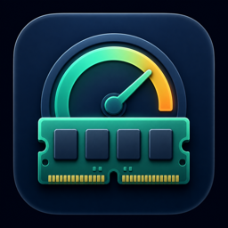
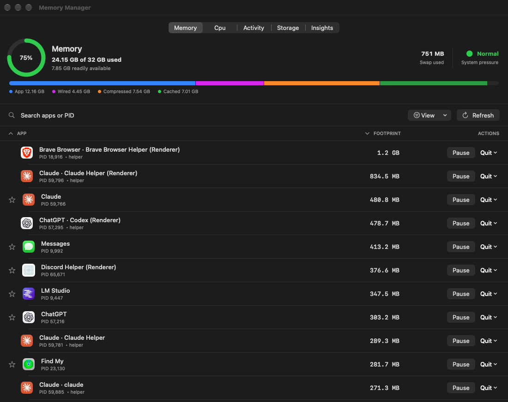
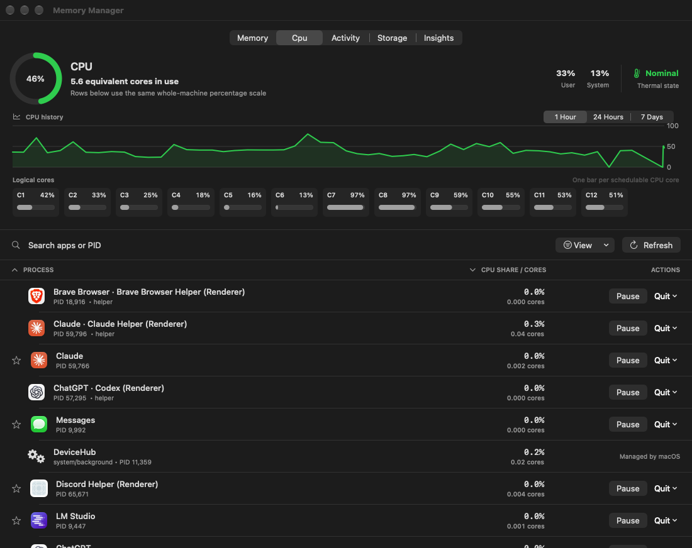
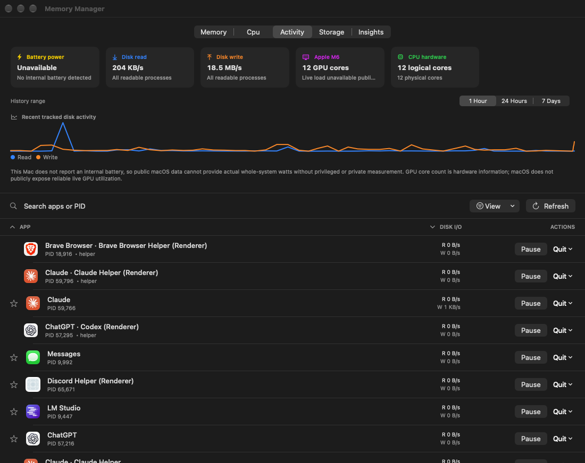
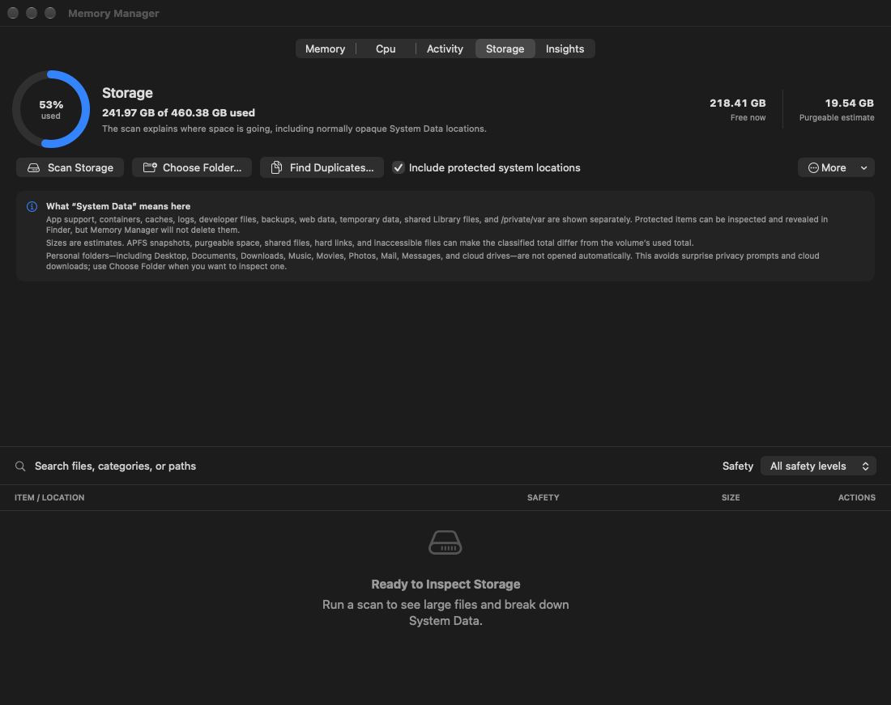
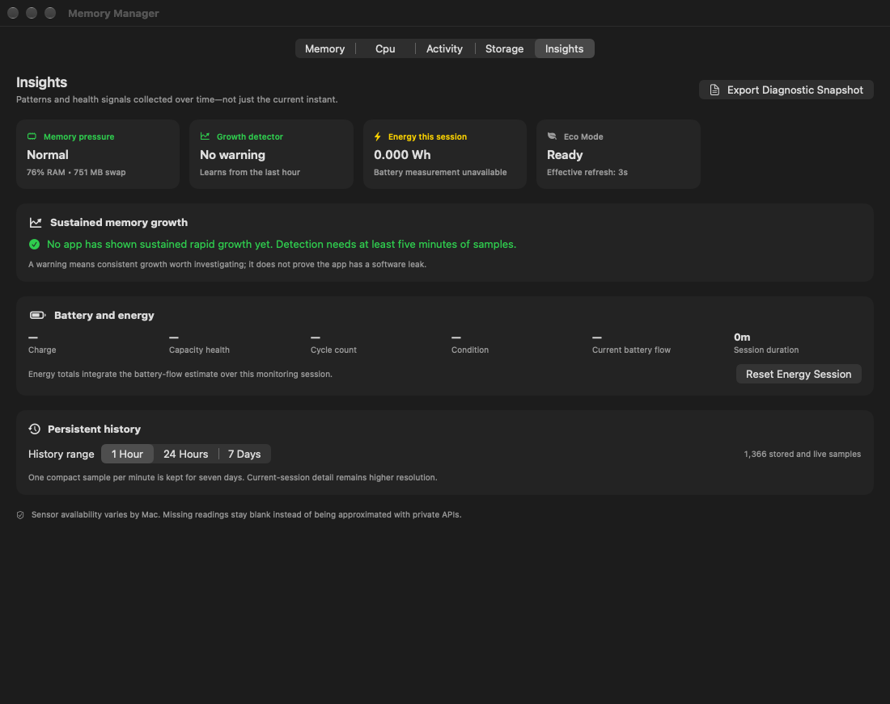
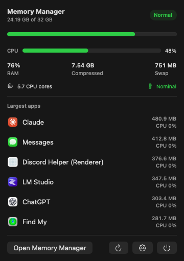

<p align="center">
  
</p>

<h1 align="center">Memory Manager</h1>

<p align="center">
  A native macOS utility for seeing which apps use the most memory, CPU, disk, and storage—and taking action before macOS runs out of memory.
</p>

<p align="center">
  <a href="https://github.com/opisaac9001/MemoryManager/releases/latest">Download</a> ·
  <a href="#features">Features</a> ·
  <a href="#safety">Safety</a> ·
  <a href="#building-from-source">Build</a>
</p>



Memory Manager is written in SwiftUI and uses only public macOS APIs. It needs no administrator privileges, helper tools, or kernel extensions.

## Screenshots

| CPU | Activity |
| --- | --- |
|  |  |

| Storage | Insights |
| --- | --- |
|  |  |

<p align="center">
  
  <br><em>Menu-bar summary</em>
</p>

## Install

**Requirements:** macOS 14 Sonoma or later, on Apple silicon or Intel.

1. Download the latest `Memory Manager <version>.dmg` from [Releases](https://github.com/opisaac9001/MemoryManager/releases/latest).
2. Open the DMG and drag **Memory Manager** onto the **Applications** shortcut.
3. Open Memory Manager from Applications, Spotlight, or Launchpad.

Release builds are ad-hoc signed, not notarized. The first time you open the app, macOS may say it can't verify the developer. To open it anyway, Control-click the app in Applications and choose **Open**, or go to **System Settings → Privacy & Security** and click **Open Anyway**.

The menu-bar readout is on by default. Use **Memory Manager → Settings** to change refresh speed, alerts, helper-process grouping, history, and Launch at Login.

## Features

### Memory
- Kernel-reported memory pressure with App, Wired, Compressed, Cached, and Swap breakdowns
- Live per-app physical footprint, with helper processes combined into their app or listed separately
- Helper processes attributed to their app, including sandboxed and detached helpers, using process ancestry, app and support-file paths, and remembered ownership
- Warnings when an app's memory keeps growing, based on a rolling one-hour trend
- Recent memory history and per-app change indicators

### CPU and activity
- Live overall CPU load, user/system split, history, and one bar per logical core
- Per-process CPU on the same whole-machine percentage scale as the headline, plus an equivalent-core readout
- Per-app disk read and write rates
- CPU and GPU hardware details, thermal pressure, and Low Power Mode status
- Live battery charge/discharge wattage, time remaining, capacity health, cycle count, and condition when the Mac reports them

### Storage
- On-demand scans with free, used, purgeable, and classified-space totals
- A breakdown of "System Data": app support, containers, caches, logs, backups, developer data, shared Library data, and `/private/var`
- Searchable list of large items, with category and safety labels
- Suggestions to review large caches, old installers, older apps, and likely leftovers from removed apps
- Duplicate-file detection that compares file contents, for folders you choose, without downloading cloud-only files
- Cleanup that moves items you confirm to the Trash, so you can still get them back

### Insights and history
- Minute-level history kept for seven days, with 1-hour, 24-hour, and 7-day chart ranges
- Automatic Eco Mode that polls less often in Low Power Mode or under thermal pressure
- Markdown diagnostic snapshots and CSV history export
- Energy used this session in watt-hours, with average and peak battery watts

### Control
- Sort apps, mark favorites, hide apps from the menu bar, and search by name or PID
- Normal quit, force quit with confirmation, and fail-safe pause/resume of an app's whole process tree
- Configurable memory, swap, CPU, and thermal notifications, with a cooldown so they don't repeat
- Launch at Login via Apple's Service Management API

## Safety

Pausing an app makes it stop responding until you resume it. Memory Manager records every process it pauses. It resumes them when it quits normally and recovers them automatically after a crash. Before sending any signal, it checks each process's start time to make sure the PID hasn't been reused by a different process. Core parts of macOS, like loginwindow, the Dock, and Control Center, can't be paused or quit from the app.

Force quitting can lose unsaved work, so the app asks you to confirm before a force quit or a pause. Some apps protected by macOS may refuse these requests. Memory Manager never asks for administrator privileges and never works around system protections.

Storage scans only run when you start them, so they don't keep using the disk and battery. Protected system locations can be viewed but not changed. Memory Manager will only move items to the Trash if they belong to you and are inside your home folder. It won't offer to remove macOS files, virtual memory, APFS snapshots, or whole standard folders. It also never touches keychains, preferences, accounts, or mail, messages, and iCloud data. Sizes are estimates, because APFS sharing, snapshots, purgeable space, hard links, and files the app can't read don't add up to a simple folder total.

Personal folders are scanned only when you pick them with **Choose Folder**. That includes Desktop, Documents, Downloads, Music, Movies, Photos, Mail, Messages, and cloud drives. This avoids surprise privacy prompts and downloading files that are only in the cloud.

macOS doesn't offer a safe public way to read GPU usage for the whole system or for each app. Memory Manager shows the GPU model and core count without using private APIs.

Battery wattage is calculated from the voltage and current macOS reports. While the Mac is plugged in, it shows the power going into or out of the battery, not the Mac's total power draw. Desktop Macs have no internal battery, so they show this reading as unavailable.

## Privacy

Memory Manager has no network code, analytics, or telemetry. History is stored locally in `~/Library/Application Support/MemoryManager`, and settings are stored in the app's standard user defaults.

## Building from source

Requirements: Xcode 15 or later. [XcodeGen](https://github.com/yonaskolb/XcodeGen) is only needed if you change `project.yml`.

```bash
git clone https://github.com/opisaac9001/MemoryManager.git
cd MemoryManager
open MemoryManager.xcodeproj
```

The checked-in Xcode project is generated from `project.yml`. After changing `project.yml`, run `xcodegen generate`.

| Script | What it does |
| --- | --- |
| `./build.sh` | Regenerates the project and builds a universal (arm64 + x86_64) Release app into `dist/`. |
| `./package.sh` | Runs `build.sh` and packages `dist/Memory Manager <version>.dmg`. |

`package.sh` can also sign with a Developer ID certificate and notarize the DMG. Set `MEMORY_MANAGER_DEVELOPER_ID` to the signing identity and `MEMORY_MANAGER_NOTARY_PROFILE` to a `notarytool` keychain profile.

Run the tests with:

```bash
xcodebuild test -project MemoryManager.xcodeproj -scheme MemoryManager -destination 'platform=macOS'
```

Memory Manager only allows one copy of itself to run. Quit any installed copy before running the tests, or the test host won't launch.

## Project layout

```
MemoryManager/
  MemoryManagerApp.swift   App entry point, menus, and menu-bar extra
  ContentView.swift        Memory, CPU, and Activity dashboards
  ProcessMonitor.swift     Process sampling, attribution, alerts, history, and system readers
  StorageMonitor.swift     Storage scanning, classification, duplicates, and Trash safety
  StorageView.swift        Storage dashboard
  InsightsView.swift       Insights dashboard
  MenuBarView.swift        Menu-bar popover
  SettingsView.swift       Settings window
MemoryManagerTests/        Unit tests
project.yml                XcodeGen project definition
```

## Contributing

Issues and pull requests are welcome. Please run the tests before opening a pull request, and keep to public macOS APIs. Features that need private APIs or administrator privileges are out of scope.

## License

Memory Manager's original source is free and open-source software under the [GNU Affero General Public License v3.0 only](LICENSE.md) (`AGPL-3.0-only`). Commercial use and paid redistribution are permitted, provided the AGPL's source-disclosure, notice, and reciprocal-licensing requirements are met. See [NOTICE.md](NOTICE.md) for attribution.
